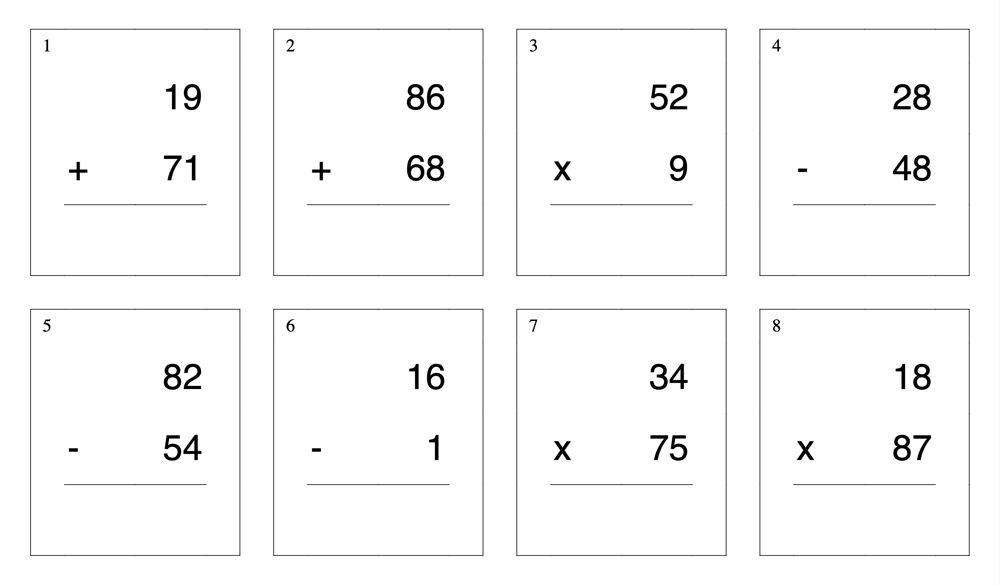
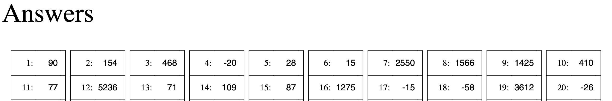

# Math Worksheet Generator




## Background
My best friend tests his 5 year old basic math questions from store-bought material which is good for one time use (his son memorizes the answers) …. but he wants to give him more practice.

Two solutions:
1. keep buying more one time usage materials (less beer budget); or
2. make question sets with the number pairs and calculate the answer for each question manually (less beer time)

Not ideal.

That's the reason for me to look into an automate way to get the job done.

## Benefit of the Math Worksheet Generator
With the Math Worksheet Generator, you can create a PDF with unique questions, as needed, in a fraction of second.

There are four choices:
1. Addition
2. Subtraction
3. Multiplication
4. Mixed

## Requirements
[python3](https://www.python.org/downloads/)

Install required package with the following command:
```
pip install -r requirements.txt
```

## How to Use
1. Generate the worksheet in pdf format with the following command:
```
python3 run.py --type [+|-|x|mix] --digits [1|2|3] [-q|--question_count] [int] --output [custom-name.pdf]
```
2. Print out the generated file `worksheet.pdf`

For addition only worksheet:
```
python3 run.py --type +
```
For calculation up to 3 digits range:
```
python3 run.py --digits 3
```
For generating different number of question, eg. 100 (default is 80):
```
python3 run.py -q 100
```
or
```
python3 run.py --question_count 100
```
For custom output filename (default is worksheet.pdf):
```
python3 run.py --output custom-name.pdf
```

## Sample
[sample worksheet](sample-worksheet.pdf)

## Code Overview
Everything is written in python in `run.py`. You can play with the font and grid size with the variables under the `# Basic settings` section.

## Contributing
I appreciate all suggestions or PRs which will help kids learn math better. Feel free to fork the project and create a pull request with your idea.

## TODO
1. Add date/name/score section to the front page
2. Add support for division in long division format

## Special Thanks
My long time friend San for the inspiration of this project and lovely sons Tim and Hin. Thanks [thedanimal](https://github.com/thedanimal) for reviewing this README and adding new features.

Also, thank you for the love and support form the [Reddit Python community](https://www.reddit.com/r/Python/comments/ja5y2m/made_this_tool_with_python_and_my_son_now_hates_me/). You guys are amazing and are helping me to make this project better.

## Successful Story
Thanks [k1m0ch1](https://github.com/k1m0ch1) for sharing this heartwarming story:
>...I made this card for my kid, and then the teacher asks me if I can make some for the kids, well its generated anyway and very helpful, and the next day he asks me to make for a whole class, and next day he wants me to make for a whole school, and a weeks later other schools want me to help to make for a whole school.    
    more than 1000 generated file, with a custom filename for every kid and sent to the email
    I'm doing it for free, while you made this free, love it <3

## Links
Thank you for your coverage. 

[PyCoder's Weekly Issue #442](https://pycoders.com/issues/442)

[PyCoder's Weekly Twitter](https://twitter.com/pycoders/status/1316379986417381376)

[Real Python Facebook](https://www.facebook.com/LearnRealPython/posts/1688239528018053?__tn__=-R)

[Github Trends Telegram](https://t.me/githubtrending/9007)